# 🌴 PalmVision – AI-Based Date Palm Disease Detection System

PalmVision is an intelligent decision-support system for **date palm disease detection** using deep learning.  
The system leverages **EfficientNetB0 enhanced with CBAM attention** to classify palm leaf images into four disease categories and provides actionable recommendations via a web-based interface.

---

## 📌 Features
- Deep learning–based palm leaf disease classification
- EfficientNetB0 + CBAM attention mechanism
- FastAPI backend for inference and system logic
- Web-based frontend for image upload and result visualization
- Per-image prediction with confidence, severity, and recommendations
- Designed for precision agriculture applications

---

## 🧠 Disease Classes
The model classifies palm leaf images into four categories:
- **Bug**
- **Dubas**
- **Honey**
- **Healthy**

---

## 📊 Dataset
- **Primary Dataset**: Date Palm Dubas Dataset  
  Source: Mendeley Data  
  https://data.mendeley.com/datasets/2nh364p2bc/2

- **Future Dataset**:  
  Drone-captured palm leaf images collected locally in Jeddah (~1,000 images), planned for future expansion.

---

## 🏗️ System Architecture
The system consists of:
- Deep Learning Model: EfficientNetB0 + CBAM
- Backend API: FastAPI (Python)
- Frontend: HTML, CSS, JavaScript
- Inference Pipeline: Image preprocessing → prediction → recommendation

---

## ⚙️ System Requirements

### Hardware Requirements
- CPU: Intel / Apple Silicon (or equivalent)
- GPU (optional): Apple Metal GPU or CUDA-enabled GPU
- RAM: ≥ 8 GB recommended

### Software Requirements
- Operating System: Windows 10+, macOS 10.15+, or Ubuntu 20.04+
- Python 3.9 or higher
- Git
- pip package manager

---
## 🖼️  Visual Results & System Overview
### 📂 Sample Data : Shows examples of palm leaf images used for training and testing.
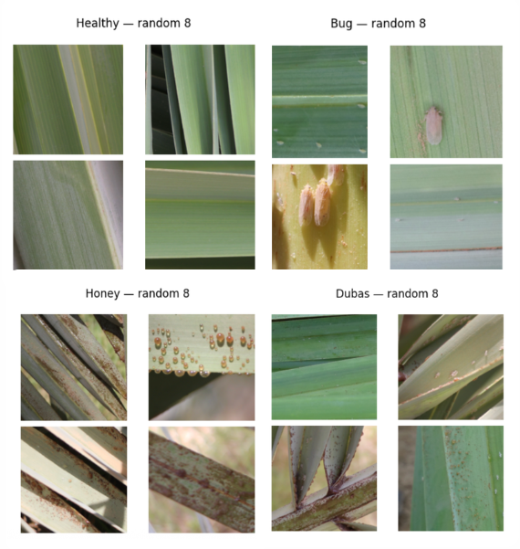

### 🏗️ System Architecture : Overall architecture of our ststem.
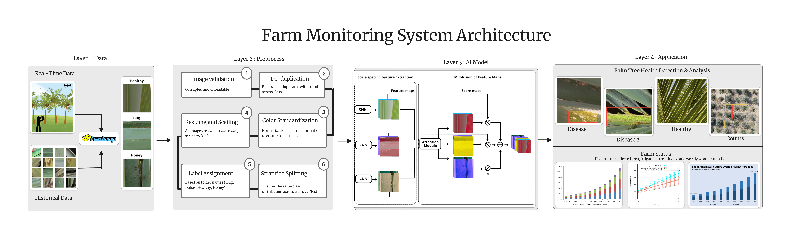

### 📊 Confusion Matrix : Performance visualization across all disease classes.
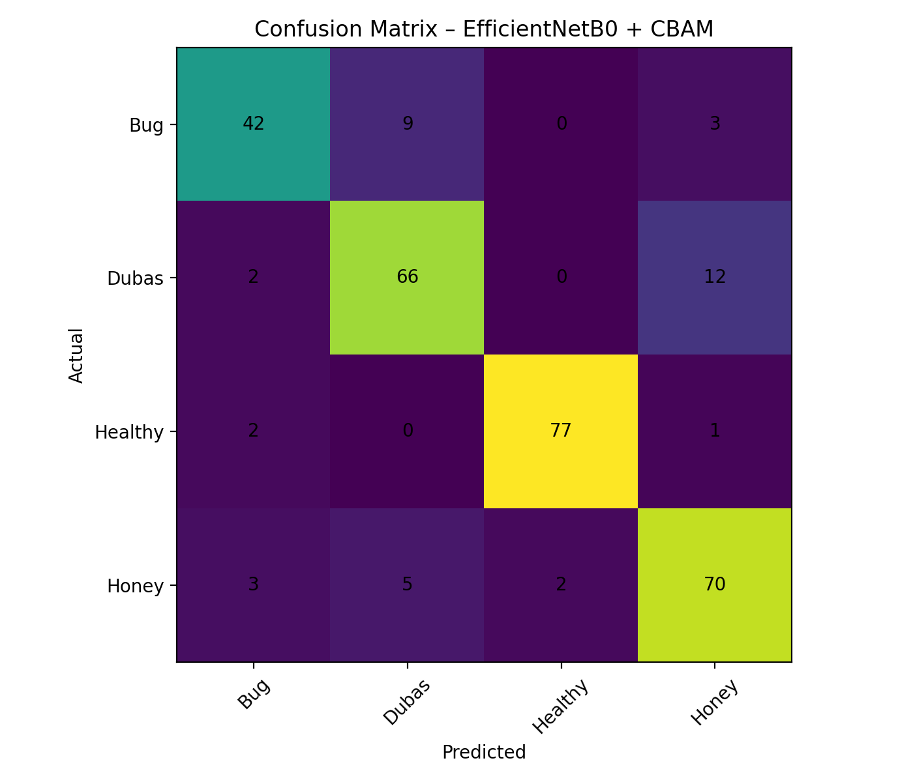

### 📉 Training & Validation Loss : Model convergence behavior during training.
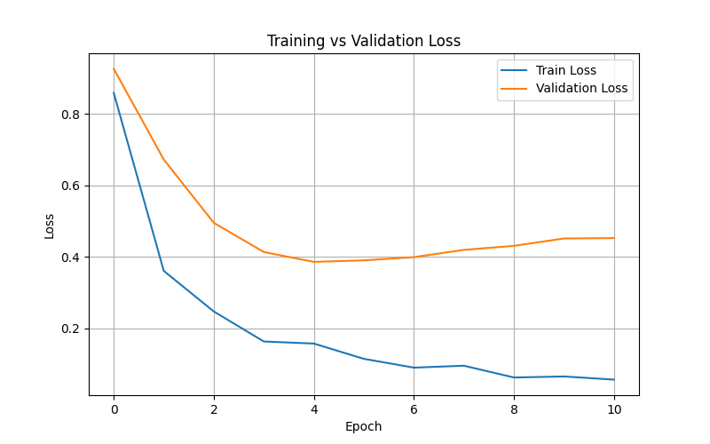

### 📈 Training & Validation Accuracy : Accuracy progression across epochs.
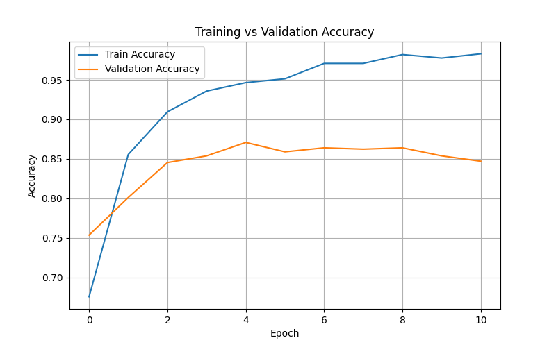

### 🖥️ Full System Interface : Screenshots showing the complete PalmVision system UI.
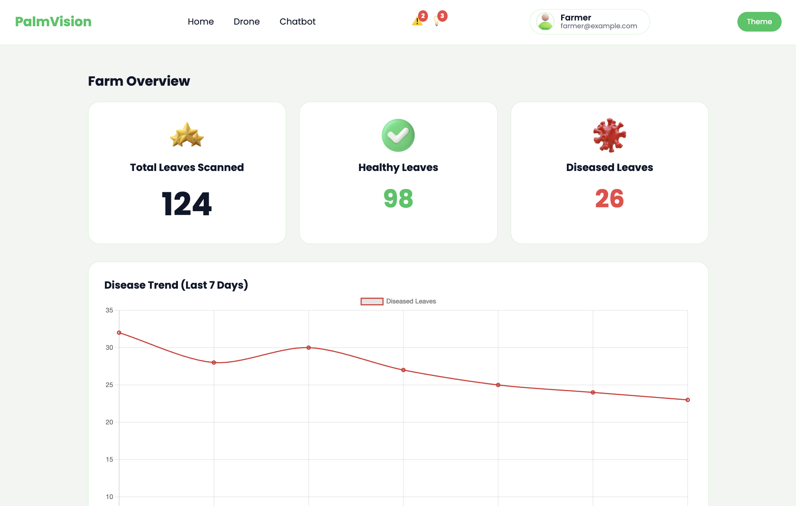
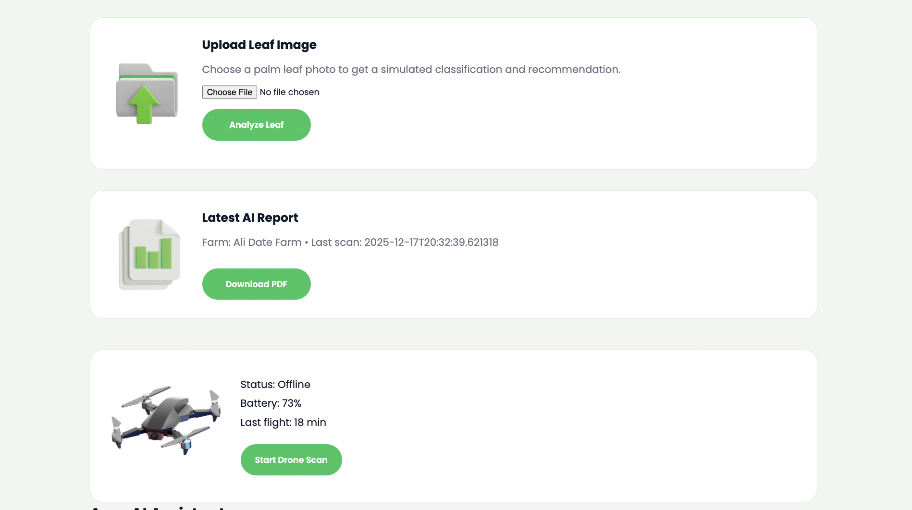
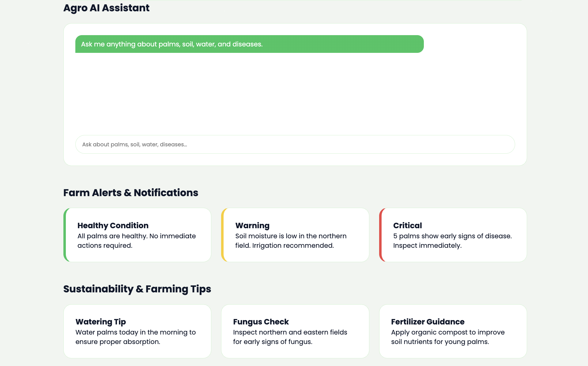

### 🔄 System Workflow (How It Works) : visualization of system operation.
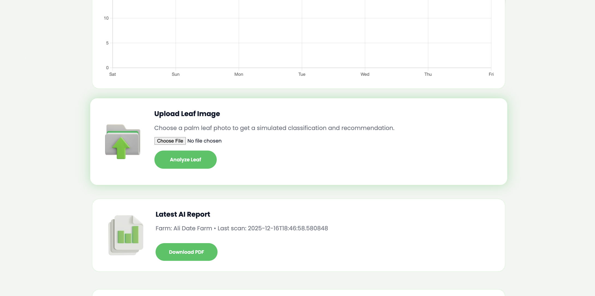
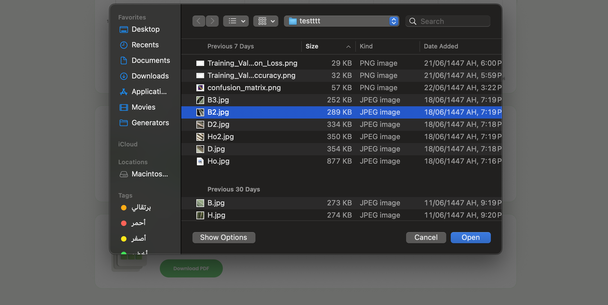
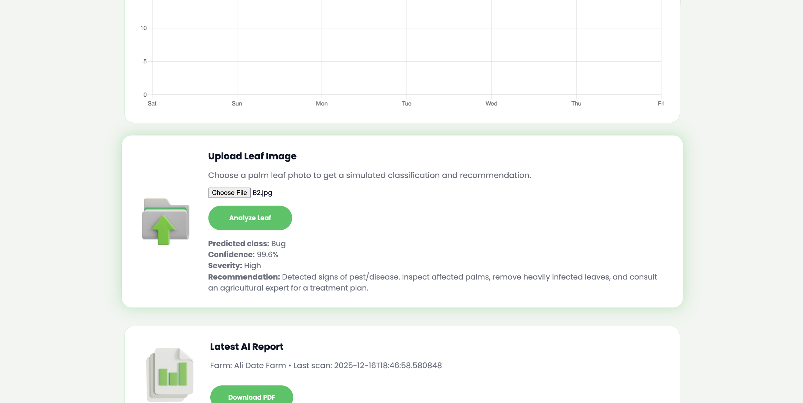

---
## 🚀 Installation Steps

### Step 1: Clone the Repository
```bash
git clone https://github.com/arwalulu/palmvision.sa.git
cd palmvision
```
### Step 2: Create a Virtual Environment
```bash
python3 -m venv .venv
source .venv/bin/activate   # macOS/Linux
# .venv\Scripts\activate    # Windows
```
### Step 3: Install Dependencies
```bash
pip install -r requirements-m1.txt
```
### Step 4: Configure Environment
```bash
models/palmvision_effb0_cbam.keras
```
### Step 5: Run the Backend Server
```bash
uvicorn backend.main:app --host 127.0.0.1 --port 8001 --reload
```
### Step 6: Open the Frontend
```bash
frontend/index.html
```
---
## 🖼️ Usage
### 1: Upload a palm leaf image via the web interface
### 2: The model predicts:
- Disease class
- Confidence score
- Severity level
- Treatment recommendation
### 3: View farm status and statistics via the dashboard
---
## 🧪 Model Performance (Test Set)
- Accuracy: 86.7%
- F1-score (macro average): 0.863
- Strong performance on Healthy, Dubas, and Honey classes
---
## 👩‍💻 Authors
Developed by : Arwa - Amalia - Dalia
Effat University – Senior Project
Field: Computer Science , AI
